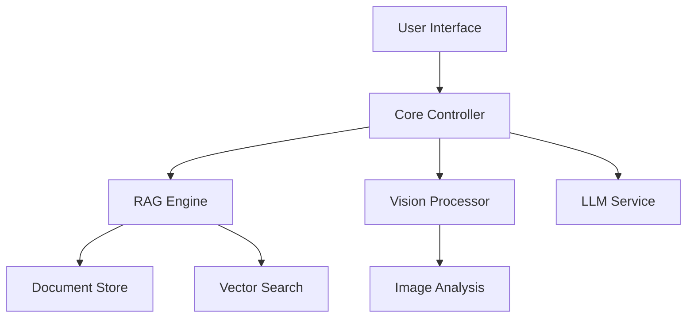

# ENSET Multimodal Educational Chatbot
> A RAG-based educational chatbot with multimodal capabilities

## Table of Contents
- [Project Description](#project-description)
- [Architecture](#architecture)
- [Technologies](#technologies)
- [Setup Guide](#setup-guide)
- [Development Steps](#development-steps)
- [API Reference](#api-reference)
- [Testing](#testing)
- [Deployment](#deployment)
- [License](#license)

## Project Description
The ENSET Multimodal Educational Chatbot is designed to provide an interactive learning experience by leveraging Retrieval-Augmented Generation (RAG) and multimodal capabilities. The chatbot can process and understand both text and images, making it a versatile tool for educational purposes. It integrates various technologies such as JavaFX for the user interface, PostgreSQL/MongoDB for document storage, and advanced AI models for natural language processing and vision tasks.

## Architecture

## Technologies

### Core Components
- JavaFX 17+ for UI
- PostgreSQL/MongoDB for document storage
- Elasticsearch/FAISS for search
- OpenAI API/Hugging Face for LLM
- LLaVA/CLIP for vision processing

## Setup Guide
### Prerequisites
- JDK 17+
- Maven/Gradle
- PostgreSQL/MongoDB
- Docker (optional)

### Installation
1. Clone the repository
    ```sh
    git clone https://github.com/yourusername/ENSET-Tutor.git
    ```
2. Navigate to the project directory
    ```sh
    cd ENSET-Tutor
    ```
3. Install dependencies
    ```sh
    mvn install
    ```

## Development Steps
1. Database Setup
    - Start your PostgreSQL/MongoDB server
    - Create a new database for the project
2. Environment Configuration
    - Copy the example environment file
        ```sh
        cp .env.example .env
        ```
    - Update the `.env` file with your configuration

## API Reference
### RAG Engine
### Vision Processor

## Testing
1. Run unit tests
    ```sh
    mvn test
    ```
2. Run integration tests
    ```sh
    mvn verify
    ```

## Deployment
1. Build the project
    ```sh
    mvn package
    ```
2. Deploy using Docker (optional)
    ```sh
    docker-compose up -d
    ```

## License
MIT